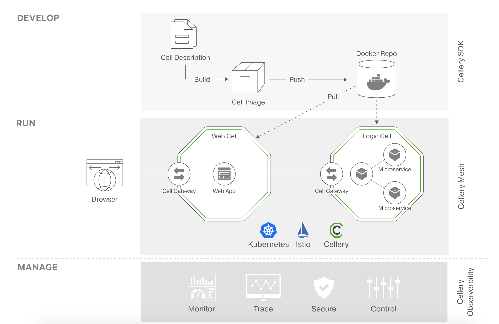

[](https://travis-ci.org/wso2-cellery/sdk)
[](https://codecov.io/gh/wso2-cellery/sdk)
[](https://github.com/wso2-cellery/sdk/releases)
[](https://github.com/wso2-cellery/sdk/releases)
[](https://github.com/wso2-cellery/sdk/commits/master)
[](https://opensource.org/licenses/Apache-2.0)


Build, run, and manage code-first composites on Kubernetes.

- For in-depth information about how to use Cellery, visit [https://wso2-cellery.github.io/](https://wso2-cellery.github.io/)                                   
- To ask questions and get assistance from our community, visit [discuss.istio.io](https://discuss.istio.io)
- To learn how to participate in our overall community, visit [our community page](https://istio.io/about/community)

In this README:

- [Introduction](#introduction)
- [Repositories](#repositories)
- [Issue management](#issue-management)

In addition, here are some other documents you may wish to read:
- [Cell Based Architecture](docs/cba.md) - explains the concepts of Cell based Architecture
- [Cellery Architecture](docs/cellery-architecture.md) - explains the high-level architecture of Cellery
- [How to code cells?](docs/cell-reference.md) - explains how Cellery cells are written
- [CLI commands](docs/cli-reference.md) - reference for CLI commands
- [Samples](https://github.com/wso2-cellery/samples) - a collection os useful samples
- [Cellery Community](docs/community.md) - describes how to get involved and contribute to the Cellery project

You'll find many other useful documents on our [Wiki](https://wso2-cellery.github.io/wiki).

## Introduction

Cellery is a code-first approach to building, integrating, running and managing composite 
microservice applications on Kubernetes. Build, push/pull, run, scale and observe composites. 
Create secure APIs by default, code components in any language.

## Why Cellery?

The use of microservices and/or serverless functions is exploding as organisations aim to get better
agility and speed of development. This quickly gets out of control, resulting in tens or hundreds 
of microservices in a highly connected network. There is a strong need for an approach that helps 
create higher-level constructs from multiple microservices and serverless functions. 
Cellery aims to create composites with well-defined boundaries that fit with CI/CD pipelines and 
modern development and DevOps practices. 
You can read more about this approach [here](https://wso2-cellery.github.io/philosophy)



Cellery is composed of these components:

- **CLI** - TODO:
- **Mesh** - TODO:

- **Observability** - TODO:

## Quickstart Guide

### Prerequisites 
1. kubectl v1.11.x (Execute `kubectl version` command and make sure kubectl client is v1.11. 
Please follow [instructions](https://kubernetes.io/docs/tasks/tools/install-kubectl/) to install kubectl v1.11.x)
2. [VirtualBox](https://www.virtualbox.org/wiki/Downloads) 

### Download Cellery
#### Linux
Download the [cellery-ubuntu-x64-0.2.1.deb](https://wso2-cellery.github.io/downloads) 
and install it using dpkg command as shown below.
```
dpkg -i cellery-ubuntu-x64-0.2.1.deb
```
#### Mac OS
Download [cellery-0.2.1.pkg](https://wso2-cellery.github.io/downloads) 
and install it by following macOS package installation steps.

### Setup Cellery runtime
Once Cellery has been installed, verify the installation is working by executing `cellery version`.

In this quickstart guide, we will install a basic local Cellery runtime in interactive mode by 
following these steps:

1. Run `cellery setup` to configure the Cellery runtime.
   Select the`create ` option to create a new runtime: 
   
   ```
    $ cellery setup
    [Use arrow keys]
    ? Setup Cellery runtime
        Manage
      ➤ Create
        Modify
        Switch
        EXIT
   ```

2. In the next prompt select `Local` to proceed with local installation. 

    ```
    $ ✔ Create
    [Use arrow keys]
    ? Select an environment to be installed
      ➤ Local
        GCP
        Existing cluster
        BACK
    ```

3. Next, select 'Basic' 

    ```
    $ ✔ Create
      ✔ Local
    [Use arrow keys]
    ? Select the type of runtime
      ➤ Basic (size: 2.17 GB)
        Complete (size: 3.74 GB)
    ```

4. Next, the CLI will prompt for confirmation to download and install the local setup. Select 'Yes'.
This will download a basic Cellery runtime VM image and run it. This step could take a few minutes.

    ```
    ✔ Create
    ✔ Local
    ✔ Basic (size: 2.17 GB)
    Use the arrow keys to navigate: ↓ ↑ → ← 
    ? Downloading cellery-runtime-basic-0.2.0.tar.gz will take 2.17 GB from your machine. Do you want to continue: 
      ▸ Yes
        No
    ```
    
5. Configure host entries
   
   Add the following line to the /etc/host file in order to access Cellery hosts.
   ```
     192.168.56.10 wso2-apim cellery-dashboard wso2sp-observability-api wso2-apim-gateway cellery-k8s-metrics idp.cellery-system pet-store.com hello-world.com my-hello-world.com
   ```    

### Run a sample

Let's quickly run a sample hello world cell as shown in the diagram below.  

 

The `hello-world-cell` contains, one component `hello` and it's a web app. The `hello` component is 
exposed globally via a global and cell gateway. In the quick start we'll be deploying this 
`hello-world-cell` and browsing the `hello` component's web page.

Please follow below instructions to run the hello-world-cell. 

**Note:** Due to the [known issue](https://github.com/wso2-cellery/sdk/issues/381), please execute 
the below commands in any directory other than home directory.

1. Execute below command that will download the hello world web cell from `wso2cellery` organization
 in [docker hub](https://hub.docker.com/u/wso2cellery) and run the cell.
    ```
    $ cellery run wso2cellery/hello-world-cell:0.2.1 -n hello-world-cell
    ✔ Connecting to registry-1.docker.io
    ✔ Fetching metadata
    ✔ Pulling image wso2cellery/hello-world-cell:0.2.1
    ✔ Saving new Image to the Local Repository
    
    Image Digest : sha256:2d5659e5787df7e7ae0f58671c0b9d857b5a19e5fbdb02fccbc98a64016a97f6
    
    ✔ Extracting Cell Image wso2cellery/hello-world-cell:0.2.1
    
    Main Instance: hello
    
    ✔ Reading Cell Image wso2cellery/hello-world-cell:0.2.1
    ✔ Validating dependencies
    
    Instances to be Used:
    
      INSTANCE NAME                            CELL IMAGE             USED INSTANCE   SHARED
     ------------------------- ------------------------------------- --------------- --------
      hello-world-cell           wso2cellery/hello-world-cell:0.2.1   To be Created    -
    
    Dependency Tree to be Used:
    
     No Dependencies
    
    ? Do you wish to continue with starting above Cell instances (Y/n)?
    
    ✔ Starting main instance hello-world-cell
    
    
    ✔ Successfully deployed cell image: wso2cellery/hello-world-cell:0.2.1
    
    What's next?
    --------------------------------------------------------
    Execute the following command to list running cells:
      $ cellery list instances
    --------------------------------------------------------
    ```
2. Optionally you can run `kubectl` or `cellery` commands to check whether all pods are up and running. 
    ```
    $ kubectl get pods
    NAME                                         READY     STATUS        RESTARTS   AGE
    hello--gateway-deployment-65fd8668cb-k7dqp   1/1       Running       0          2m
    hello--hello-deployment-6df6fcbd8c-2s65r     2/2       Running       0          2m
    hello--sts-deployment-6dc7958bbb-sg992       2/2       Running       0          2m
    ```
    OR
    
    ```
    $ cellery list instances
                      INSTANCE                                   CELL IMAGE          STATUS                            GATEWAY                            COMPONENTS            AGE
     ------------------------------------------ ----------------------------------- -------- ----------------------------------------------------------- ------------ -----------------------
      hello                                      wso2cellery/hello-world-cell:0.2.1   Ready    hello--gateway-service                                      1            30 minutes 48 seconds
    ```

3. You would have added an entry into your `/etc/hosts` file during the setting up your runtime 
[local setup](docs/setup/local-setup.md#configure-host-entries), 
[Existing Cluster](docs/setup/existing-cluster.md#configure-host-entries), 
and [GCP setup](docs/setup/gcp-setup.md)     , 
so that your browser will use the right IP address for `hello-world.com`. Use the `kubectl` tool to make sure the IP your service is running on:
    ```
    $ kubectl get ingress
    NAME                     HOSTS             ADDRESS        PORTS   AGE
    hello--gateway-ingress   hello-world.com   192.168.56.10   80      3m
    ```
    Check it's correctly configured in `/etc/hosts` to resolve `hello-world.com` to one of those IPs. 
    ```
    192.168.56.10  hello-world.com
    ```

4. Now browse [http://hello-world.com/](http://hello-world.com/) and you will should see the cell web page running.

    Congratulations! You have successfully got running the first web cell running!
    
5. List the cells that are running in the current setup by `cellery list instances`.

    ```
    $ cellery list instances
         INSTANCE                      CELL IMAGE          STATUS               GATEWAY               COMPONENTS            AGE
     ---------------- ----------------------------------- -------- --------------------------------- ------------ -----------------------
      my-hello-world   <ORGNAME>/hello-world-cell:1.0.0      Ready    my-hello-world--gateway-service   1            27 minutes 42 seconds
    ```
    
6. Terminate the cell instance that you started using the `cellery terminate` command.

    ```
    $ cellery terminate my-hello-world
    ```
    
    


