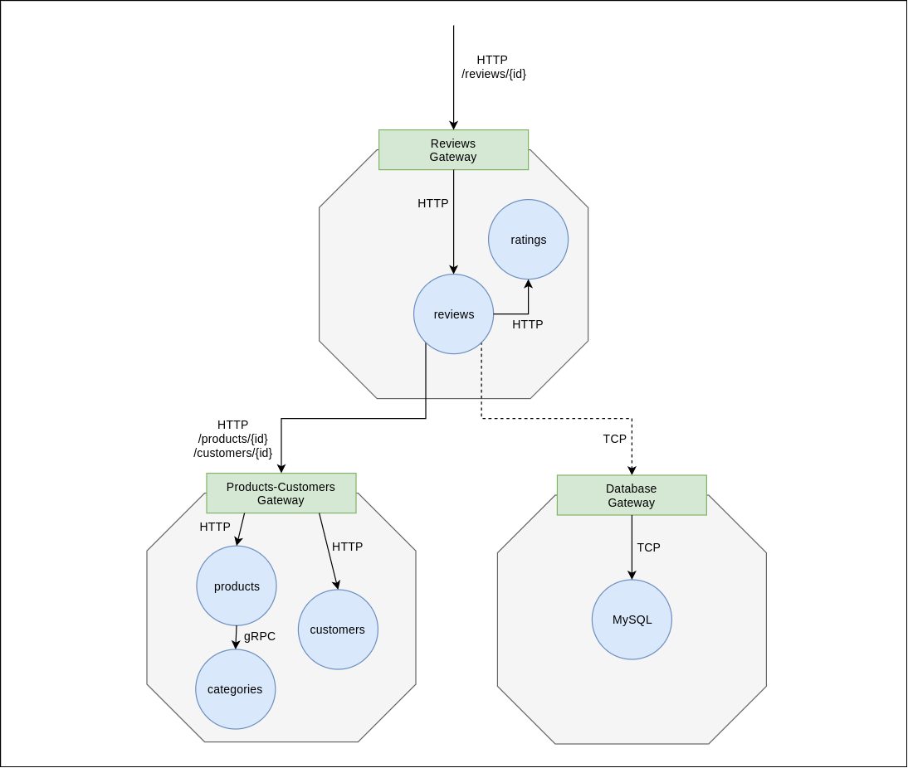

# Cellery Product Review Sample

The application shows information about user reviews for the set of products. Each of the review item shows product information, product category information, customer information, rating and review description.

This samples demonstrate following features of the cellery.

* Intra-Cell communication
* Inter-Cell communication
* Different Protocol usage

The Product Review Sample application has five microservices which are group into three seperate cells.


The component interaction diagram of the application is shown below.



## Deploying the application using kubectl

1. Run the following command from the sdk root directory
   
    ```bash
    kubectl apply -f ./samples/product-review/
    ```
2. Wait until all the cells get into ‘Ready’ state. Use the following command to check the cell state
   
    ```bash
    kubectl get cells 
    ```

## Invoking the application from your local machine

#### Note: 
By default, the Cellery installation will be using the following domain names,
    ```
    wso2-apim 
    cellery-dashboard 
    wso2sp-observability-api 
    wso2-apim-gateway
    ```
These should be properly mapped to the Kubernetes IngressController IP of the deployment.

1. Login to the API [Store](https://wso2-apim/store/) using admin:admin credentials.

2. Click on ‘reviews_global_1_0_0_reviews_1’ to create a subscription and generate a token. 
(See  [Subscribing to an API](https://docs.wso2.com/display/AM260/Subscribe+to+an+API))

3. Invoke the API using 
    ```bash
    # To retrieve data from memory
    curl  https://wso2-apim-gateway/reviews/reviews-1/reviews -H "Authorization: Bearer <access_token>" -k
    # To retrieve data from database
    curl  https://wso2-apim-gateway/reviews/reviews-1/reviews?db=true -H "Authorization: Bearer <access_token>" -k
    ```
## Cleaning up

Use following command to delete product-review sample

```bash
kubectl delete -f ./samples/product-review/
```
